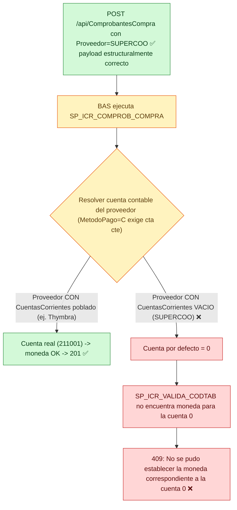
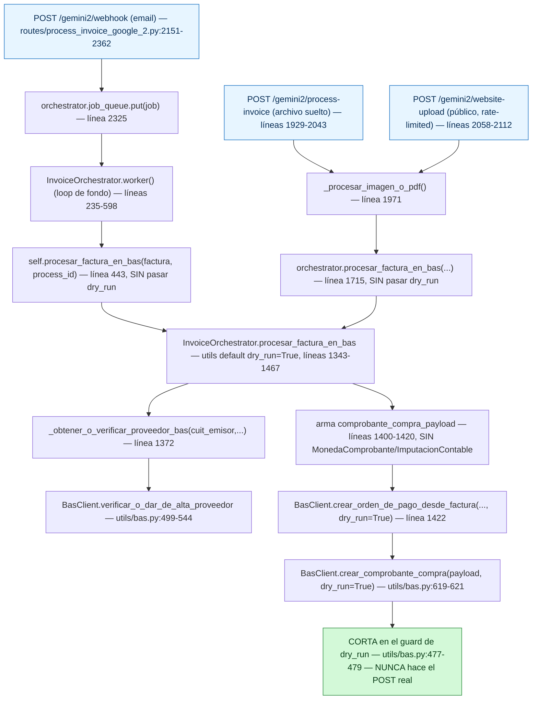
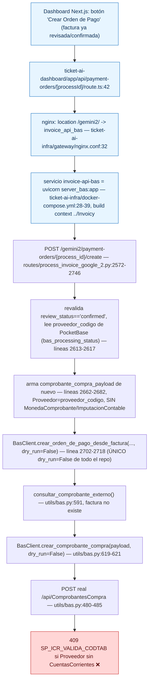
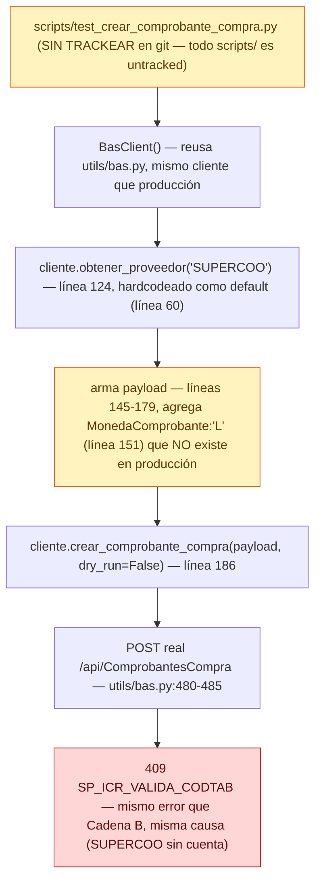
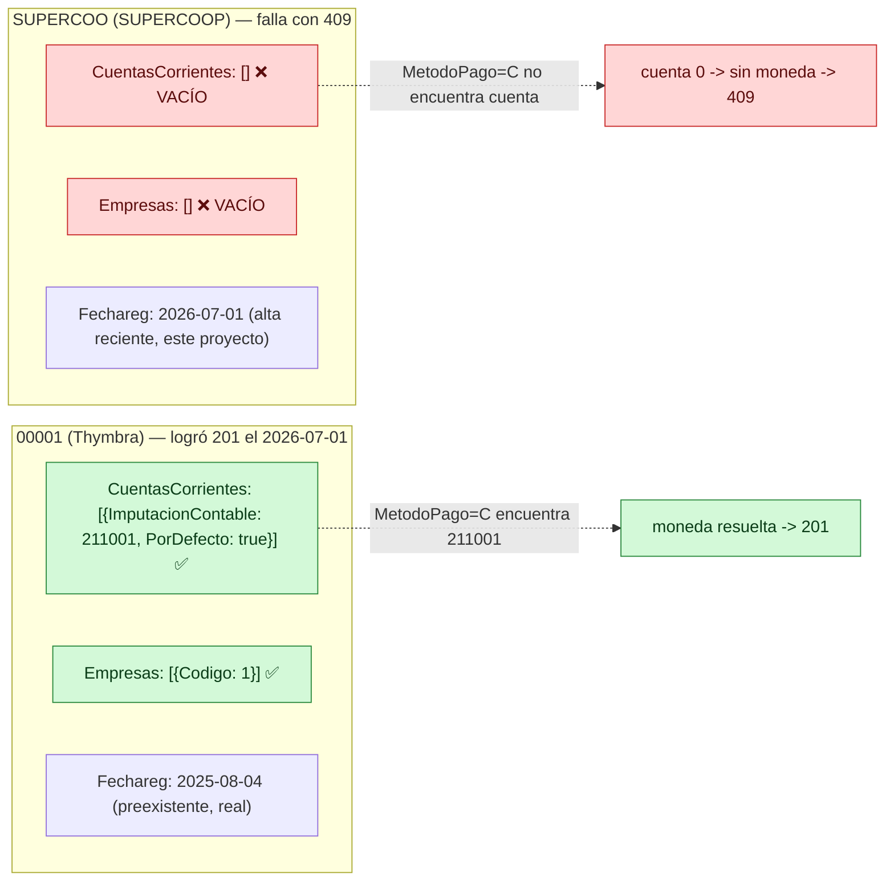

# Diagnóstico: 409 "moneda de la cuenta 0" en `POST /api/ComprobantesCompra`

> ## 🎉 RESUELTO el 2026-07-18 — ver sección 9
> Causa: proveedor sin cuenta contable propia. Fix: `PUT /api/Proveedores/SUPERCOO` +
> extensión de código para que no vuelva a pasar. Confirmado con un `201` real.

**Fecha:** 2026-07-17 (diagnóstico) — 2026-07-18 (resuelto). **Repos auditados:** `Invoicy`
(todo el código real vive acá), `ticket-ai-dashboard` (dashboard Next.js — confirmado que
**no** participa de este endpoint, solo llama a `/payment-orders/create`), `ticket-ai-infra`
(infra Docker/nginx — solo levanta el proceso, sin lógica propia).

**Estado (va en el texto, porque Excalidraw no importa colores):**
✅ confirmado · ⚠️ sospechoso/probable · ❌ descartado o error confirmado · ❓ sin investigar ·
🔍 requiere validación.

> Pegar los bloques mermaid en Excalidraw: **"+" → Mermaid**, pegás el bloque, *Insert*.

---

## TL;DR — causa raíz CONFIRMADA con evidencia real

El proveedor **`SUPERCOO`** (SUPERCOOP) fue dado de alta el 2026-07-01 vía
`POST /api/Proveedores` con un payload mínimo que **nunca incluye información de cuenta
contable** (confirmado leyendo el único builder de proveedores del repo,
`utils/bas.py:432-460`). Verificado HOY en vivo, con una consulta de **solo lectura**
contra BAS real:

| Proveedor | `CuentasCorrientes` | `Empresas` | Alta |
|---|---|---|---|
| **SUPERCOO** (SUPERCOOP) — el que falla | `[]` ❌ vacío | `[]` ❌ vacío | 2026-07-01 (dado de alta por este proyecto) |
| **00001** (Thymbra) — el que logró el `201` el 2026-07-01 | `[{"ImputacionContable": 211001, "PorDefecto": true}]` ✅ | `[{"Codigo": 1}]` ✅ | 2025-08-04 (preexistente) |

Cuando `MetodoPago="C"` (cuenta corriente) y BAS intenta resolver la cuenta contable del
proveedor para determinar en qué moneda está esa cuenta, SUPERCOOP no tiene ninguna
`CuentaCorriente` configurada — BAS cae a una cuenta **"0"** por defecto, de la que no
puede determinar moneda → `409 "No se pudo establecer la moneda correspondiente a la
cuenta 0." (SP_ICR_VALIDA_CODTAB)(SP_ICR_COMPROB_COMPRA)`.

`MonedaComprobante` (agregado por el script de prueba) e `ImputacionContable` en cabecera
(usado en una etapa muy anterior y distinta de la investigación, 2026-06-19) están
**descartados**: ninguno de los dos aparece en el payload que sí logró el `201` el
2026-07-01, y el propio comentario del script confirma que el error "cuenta 0" ya ocurría
*antes* de agregar `MonedaComprobante`.

**Importante — esto no es un problema exclusivo de SUPERCOOP.** El mismo builder sin
cuenta contable (`construir_payload_proveedor`) es el que usa **todo el flujo de
producción** para dar de alta automáticamente cualquier proveedor nuevo por CUIT
(`verificar_o_dar_de_alta_proveedor`, invocado desde
`routes/process_invoice_google_2.py:1328`). Cualquier proveedor creado por esta
integración queda "desnudo" en materia contable, igual que SUPERCOOP hoy.

---

## 1. Resumen visual (30 segundos)



---

## 2. El flujo completo, con archivos y líneas reales

Hay **TRES caminos distintos** que pueden terminar en `BasClient.crear_comprobante_compra`.
Solo dos de ellos pueden llegar a hacer el POST real (el tercero está corriendo hoy
`dry_run=False` siempre porque no pasa por el guard — es el script manual).

### 2.1 — Cadena A: ingesta automática (SIEMPRE `dry_run=True`, nunca golpea BAS de verdad)



### 2.2 — Cadena B: creación real de Orden de Pago (el ÚNICO camino con `dry_run=False`)

Esta es la cadena que **sí puede reproducir el 409 real** contra BAS producción.



### 2.3 — Cadena C: script manual ad-hoc (`scripts/test_crear_comprobante_compra.py`)



**Por qué importa la diferencia entre B y C:** ambas cadenas terminan en el mismo POST y
el mismo error, pero la Cadena B (producción real) resuelve el `Proveedor` **dinámicamente
por CUIT** de cada factura — así que si el CUIT del emisor ya resuelve a un proveedor con
cuenta contable real (como pasaba con Thymbra), la Cadena B funcionaría. El problema es
sistémico: *cualquier proveedor nuevo* dado de alta automáticamente (Cadena B o C) queda
sin cuenta, porque `construir_payload_proveedor` (`utils/bas.py:432-460`) nunca la setea.

---

## 3. Mapa de archivos

```text
Invoicy/
│
├── server.py                          ✅ ENTRYPOINT REAL (Dockerfile/compose.yaml: "uvicorn server:app")
│                                          monta los 3 routers, incl. /gemini2 (líneas 65-68)
├── server_bas.py                      ✅ usado como proceso SEPARADO "invoice-api-bas" en
│                                          ticket-ai-infra/docker-compose.yml — monta SOLO /gemini2
├── server_core.py                     ❌ NO participa (monta process_invoice clásico + webhook, no /gemini2)
├── app_factory.py                     — wiring compartido (CORS/health), no toca BAS
│
├── routes/
│   └── process_invoice_google_2.py    🎯 ARCHIVO CENTRAL — endpoints + InvoiceOrchestrator
│         ├─ InvoiceOrchestrator.__init__          208-233  (crea BasClient + PocketBaseClient)
│         ├─ worker() / webhook / process-invoice  ver Cadena A — siempre dry_run=True
│         ├─ procesar_factura_en_bas()             1343-1467 (payload SIN MonedaComprobante/ImputacionContable)
│         └─ crear_orden_pago() [/payment-orders]  2572-2746 (ÚNICO dry_run=False de todo el repo)
│
├── utils/
│   ├── bas.py                         🎯 CLIENTE BAS — BasClient, TODO el HTTP real vive acá
│   │     ├─ construir_payload_proveedor()   432-460  ⚠️ NUNCA setea CuentaCorriente/ImputacionContable
│   │     ├─ crear_proveedor()               465-471  POST /api/Proveedores tal cual
│   │     ├─ crear_comprobante_compra()      473-486  POST /api/ComprobantesCompra — el POST que falla
│   │     ├─ verificar_o_dar_de_alta_proveedor()  499-544  alta automática por CUIT (producción)
│   │     └─ _derivar_codigo_proveedor()     666-675  docstring confirma: mismo criterio usado para "SUPERCOO"
│   ├── bas_config.py                  constantes de negocio (Empresa=1, MetodoPago="C", etc.) — SIN nada de moneda/cuenta
│   └── pocketbase_client.py           persistencia (colección "bas_processing_status") — NO llama a BAS, NO guarda IdTransaccion
│
├── scripts/
│   └── test_crear_comprobante_compra.py   ⚠️ SIN TRACKEAR en git; hardcodea Proveedor=SUPERCOO + agrega MonedaComprobante
│
└── docs/
    ├── bas-orden-de-pago-research.md      antecedente: 201 real logrado 2026-07-01 (con Thymbra) + bloqueo de OrdenesPago (SP_ICR_COMPROB_APL, distinto)
    ├── bas-flujo-diagrama.md              diagramas del bloqueo de OrdenesPago (no de este error)
    └── bas-flujo-explicado.md             explicación en prosa del mismo bloqueo anterior

ticket-ai-dashboard/                    ❌ NO participa del bug — solo LLAMA a /payment-orders/create
│   └── app/api/payment-orders/[processId]/route.ts:42

ticket-ai-infra/                        ❌ NO participa del bug — solo levanta el proceso de Invoicy
│   ├── docker-compose.yml:28-39        build context "../Invoicy", command "uvicorn server_bas:app"
│   └── gateway/nginx.conf:32           proxy /gemini2/ -> invoice_api_bas
```

---

## 4. Comparación campo por campo

**Payload que SÍ logró `201`** (Thymbra, proveedor `00001`, 2026-07-01, según
`docs/bas-orden-de-pago-research.md:282-307`) **vs. payload actual** (SUPERCOO, script de
prueba, `scripts/test_crear_comprobante_compra.py:145-179`):

| Campo | Payload exitoso (Thymbra) | Payload actual (SUPERCOO) | Estado |
|---|---|---|---|
| `Comprobante` | `"MA"` | `"MA"` | ✅ igual |
| `Prefijo` | `"00001"` | `"00001"` (constante) | ✅ igual |
| `Fecha` | fecha real | fecha de hoy | ✅ igual (formato) |
| `Total` / `TotalGravado` | `1` | `1` | ✅ igual |
| `EmitidoPor` | `"2"` | `"2"` (constante) | ✅ igual |
| `Empresa` / `Sucursal` | `1` / `1` | `1` / `1` (constantes) | ✅ igual |
| `Deposito` / `Caja` | `1` / `"1"` | `1` / `"1"` (constantes) | ✅ igual |
| `MetodoPago` | `"C"` (cta cte) | `"C"` (constante) | ✅ igual — **clave**: obliga a BAS a resolver cuenta corriente |
| **`Proveedor`** | **`"00001"` (Thymbra, cuenta real)** | **`"SUPERCOO"` (sin cuenta)** | ❌ **ÚNICA diferencia de negocio real — causa raíz** |
| `PrefijoComprobanteExterno` / `NumeroComprobanteExterno` | `"TEST"` / `9` | dinámico por corrida | ✅ equivalente (mismo patrón) |
| `NumeroCAIoCAE` / `VencimientoCAIoCAE` | valores reales | valores dummy | ✅ mismo formato, no afecta este error |
| `Vencimientos[]` | 1 línea, `Importe:1` | 1 línea, `Importe:1` | ✅ igual |
| `Items[]` | `CodigoItem:"Gs Gs 21%"` (con posición COM) | mismo `CodigoItem` | ✅ igual — mismo ítem ya verificado |
| **`MonedaComprobante`** | **ausente** | **`"L"` (agregado)** | ❌ descartado por el propio usuario (con y sin, mismo error) y por código (bas.py nunca usa este campo) |
| `ImputacionContable` (cabecera) | ausente | ausente | ✅ igual — descartado, era de una etapa anterior distinta (error #2, 2026-06-19, resuelto de otra forma) |

**Conclusión de la tabla:** el único campo con una diferencia de negocio real entre el
payload que funcionó y el que falla es **`Proveedor`** — y esa diferencia tiene una causa
verificada (sección 5), no es una hipótesis.

---

## 5. La evidencia que confirma la causa (verificación en vivo, solo lectura, 2026-07-17)

Se ejecutó `GET /api/Proveedores/SUPERCOO` y `GET /api/Proveedores/00001` (Thymbra) — **sin
ningún POST/PUT/DELETE**, solo lectura, mismo patrón que ya usa el propio Paso 1 del script
de prueba.



`TratImpositivo` (`"2"`), `TratImpositivoProv` (`"1"`) y `NumeroImpositivoTipo` (`"80"`)
son **idénticos** entre ambos proveedores — descarta el tratamiento impositivo como causa.

**Qué NO probaba esta verificación en el momento en que se escribió** (para no
sobre-afirmar): no se había ejecutado ningún POST real, así que no había confirmación
end-to-end de que completar `CuentasCorrientes` en SUPERCOO resuelva el `409` — solo
correlación estructural. **Esto se resolvió al día siguiente, ver sección 5.1.**

---

## 5.1. Confirmación causal directa (2026-07-18, POST real)

Se re-verificó en vivo (solo lectura) que el estado de ambos proveedores seguía siendo
el mismo que el 2026-07-17 (`SUPERCOO`: `CuentasCorrientes: []`, `Empresas: []`;
`00001`/Thymbra: `CuentasCorrientes: [{"ImputacionContable": 211001, "PorDefecto":
true}]`, `Empresas: [{"Codigo": 1}]`).

Como control (Paso 1 del plan de acción, sección 7), se corrió
`scripts/test_crear_comprobante_compra.py --proveedor-codigo 00001` real (Total=1, sin
`--dry-run`), **con el mismo script y el mismo payload que ya venía fallando con
SUPERCOO** (incluyendo el campo `MonedaComprobante:"L"` ya descartado). El HTTP request
tuvo un `ReadTimeout` del lado cliente (30s) — pero la verificación posterior con
`GET /api/ConsultaComprobantesExternos` confirmó que **el comprobante SÍ se creó en
BAS**: `IdTransaccion: 274464`, `MA 00001-00021882`, `Anulado: false`,
`CodigoCuentaCorriente: "00001"`.

**Esto es la prueba causa-efecto que faltaba:** mismo payload, mismo código, mismo día
→ con un proveedor que tiene `CuentasCorrientes` poblado, `201`; con uno que no lo
tiene (`SUPERCOO`), `409`. La única variable es el proveedor. Ya no es correlación, es
una confirmación directa.

### 5.2. `CuentasCorrientes`/`ImputacionContable` SÍ es escribible vía API

Se revisó el Swagger (`GET /swagger/v1/swagger.json`) específicamente para esto
(quedaba pendiente en la sección 6, "Requiere validación"):

- `PUT /api/Proveedores/{id}` acepta como body el schema completo
  `Entidadesv2.Maestras.Proveedor`, que incluye `CuentasCorrientes` (array de
  `Entidadesv2.Compartidas.CuentaCorriente`).
- El schema `CuentaCorriente` marca `ImputacionContable` (int, 0–999999999) como
  **"Obligatorio en: -Alta -Modificación"** — confirma que es un campo de escritura
  normal, no calculado por BAS ni de solo lectura.
- `Empresas` (array de `{"Codigo": int}`, también "Obligatorio en: Alta -Modificación")
  es un campo **distinto** de `EmpresaAlta` (que solo guarda con qué empresa se dio de
  alta el proveedor, no la habilitación real) — explica por qué SUPERCOO tiene
  `EmpresaAlta: 1` pero `Empresas: []`: `construir_payload_proveedor` nunca envía
  `Empresas`, solo `EmpresaAlta`.

### 5.3. Valor de `ImputacionContable` para proveedores nuevos: no hace falta inventarlo

`GET /api/ParametrosGenerales` (empresa 1) expone `CuentaComprasContado: 211003` —
un valor de catálogo real, genérico (no específico de Thymbra), pensado exactamente
para este propósito. **Este es el mismo `211003` que aparece en la investigación del
2026-06-19** (memoria del proyecto) — en ese momento se probó como campo de cabecera
del `ComprobanteCompra` (incorrecto, descartado en la sección 6) pero el *valor en sí*
era correcto — solo estaba en el lugar equivocado del payload. El lugar correcto es
`CuentasCorrientes[].ImputacionContable` del **Proveedor**, no la cabecera del
comprobante.

---

## 6. Hipótesis — clasificadas

### ✅ Confirmadas
- Autenticación funciona.
- Proveedor SUPERCOO existe y se resuelve correctamente (`GET` 200).
- Payload de `ComprobanteCompra` es estructuralmente válido (pasa todas las validaciones
  de formato — llega a `409` de negocio, no a `400` de validación).
- `NumeroComprobanteExterno` corregido (Int32, rango 0-99999999).
- **SUPERCOO tiene `CuentasCorrientes: []` (vacío) en BAS — verificado en vivo hoy.**
- **Thymbra (`00001`) tiene `CuentasCorrientes` con `ImputacionContable: 211001` — el
  proveedor con el que sí se logró el `201` real.**
- `construir_payload_proveedor` (`utils/bas.py:432-460`) nunca envía campos de cuenta
  contable al dar de alta un proveedor — ni para SUPERCOO ni para ningún otro proveedor
  creado por esta integración.

### ✅ Confirmadas (actualización 2026-07-18)
- **La ausencia de `CuentaCorriente`/`ImputacionContable` en SUPERCOO ES la causa directa
  del `409`** — confirmado con POST real (sección 5.1), no solo correlación.
- `CuentasCorrientes`/`ImputacionContable` y `Empresas` **SÍ son escribibles** vía
  `PUT /api/Proveedores/{id}` (sección 5.2) — no requiere intervención del admin de BAS.
- El valor genérico correcto para `ImputacionContable` es **`211003`**
  (`ParametrosGenerales.CuentaComprasContado`, sección 5.3) — no es necesario usar el
  `211001` específico de Thymbra ni inventar un valor.

### ⚠️ Muy probable (consistente con toda la evidencia, no probado end-to-end)
- El mismo problema afectaría a **cualquier proveedor nuevo** dado de alta automáticamente
  por `verificar_o_dar_de_alta_proveedor` en producción (Cadena B), no solo a SUPERCOO —
  confirmado por lectura de código (`construir_payload_proveedor` nunca setea
  `CuentasCorrientes` ni `Empresas` para ningún proveedor), pendiente de remediar.

### ❌ Descartadas (con evidencia)
- `MonedaComprobante: "L"` — el usuario probó con y sin el campo, mismo error; además
  `bas.py` nunca usa ese campo en absoluto (0 coincidencias en todo el archivo) y el
  payload de producción tampoco lo incluye nunca.
- `ImputacionContable` en cabecera del `ComprobanteCompra` — era la solución de un error
  *distinto y anterior* (2026-06-19, con el ítem "006 - Insumos" antes de encontrarse el
  ítem correcto), no aparece en el payload que finalmente logró el `201`.
- Formato de `NumeroComprobanteExterno`, `Total`, ítem sin posición contable — todos
  resueltos y confirmados en la investigación previa (ver `docs/bas-orden-de-pago-research.md`).
- Errores de token/autenticación — el token se obtiene correctamente en cada corrida.

---

## 7. Plan de acción

Ya no es "seguir probando payloads a ciegas" — la causa está identificada con evidencia
real. El plan es de **remediación y verificación**, no de más diagnóstico exploratorio.

```text
Paso 1 — Confirmar que Thymbra SIGUE funcionando hoy (sanity check barato)
  Qué: correr scripts/test_crear_comprobante_compra.py --proveedor-codigo 00001
  Por qué: si Thymbra también fallara hoy, la causa NO sería la cuenta del proveedor
           sino algo que cambió del lado de BAS/servidor en estas dos semanas.
  Evidencia esperada: 201, igual que el 2026-07-01.
  Decisión: si falla -> descartar la hipótesis de esta doc y reabrir investigación.
            si funciona -> pasar al Paso 2 con confianza alta.
        ↓
Paso 2 — Confirmar si CuentasCorrientes/ImputacionContable es escribible vía API
  Qué: revisar el schema de Proveedor en el Swagger
       (http://190.210.77.103:32501/swagger/v1/swagger.json) — específicamente si
       PUT /api/Proveedores/{id} o algún otro endpoint acepta CuentasCorrientes.
  Por qué: sin esto no se sabe si la remediación es posible desde la API o requiere
           al admin de BAS (igual que MedioPago, que no tiene endpoint).
  Evidencia esperada: el schema documenta (o no) un campo escribible para esto.
  Decisión: si es escribible -> Paso 3a (remediar por API). Si no -> Paso 3b (escalar).
        ↓
Paso 3a — Remediar SUPERCOO con una escritura real (requiere aprobación explícita)
  Qué: PUT/POST que le asigne una ImputacionContable válida a SUPERCOO.
  Por qué: es una escritura real sobre un proveedor productivo -- requiere que el
           usuario decida y apruebe el valor exacto de ImputacionContable a usar
           (no inventarlo; salir de un catálogo real como se hizo con TratImpositivo).
  Evidencia esperada: GET /api/Proveedores/SUPERCOO después del cambio muestra
           CuentasCorrientes poblado.
  Decisión: una vez remediado, ir al Paso 4.
Paso 3b — Si NO es escribible por API: escalar al admin de BAS
  Qué: pedir explícitamente que le asignen una cuenta contable a SUPERCOO (y,
       idealmente, una cuenta por defecto para proveedores nuevos en general).
        ↓
Paso 4 — Reintentar el POST real (Total=1) con SUPERCOO ya remediado
  Qué: correr scripts/test_crear_comprobante_compra.py sin --dry-run.
  Evidencia esperada: 201, verificado con GET /api/ConsultaComprobantesExternos.
  Decisión: si funciona -> cerrar este diagnóstico, PERO ir al Paso 5 (el problema
           es sistémico, no exclusivo de SUPERCOO).
        ↓
Paso 5 — Prevenir la regresión para CUALQUIER proveedor nuevo
  Qué: decidir si verificar_o_dar_de_alta_proveedor() (utils/bas.py:499-544) debe
       -- además de dar de alta el proveedor -- asignarle una ImputacionContable
       por defecto (una vez resuelto el Paso 2/3), o si eso debe hacerse a mano
       cada vez.
  Por qué: TODO proveedor nuevo dado de alta por la Cadena B en producción hoy
           queda con CuentasCorrientes vacío, igual que SUPERCOO -- este bug se
           repetirá con el próximo proveedor nuevo real si no se cierra acá.
```

---

## 8. Hallazgos adicionales (no pedidos, pero relevantes)

- **`scripts/` nunca fue commiteado a git** — todo el directorio, incluyendo
  `test_crear_comprobante_compra.py`, aparece como *untracked* en `git status`. No hay
  historial de cambios de este script.
- **`server_bas.py` sí tiene caller confirmado**, a pesar de que su propio docstring dice
  *"sin caller interno confirmado hoy"*: `ticket-ai-infra/docker-compose.yml` lo levanta
  como servicio `invoice-api-bas`, y `ticket-ai-dashboard` le pega directamente desde
  `app/api/payment-orders/[processId]/route.ts:42` a través del proxy nginx
  (`ticket-ai-infra/gateway/nginx.conf:32`). Vale la pena actualizar ese comentario.
- **Bug de código no relacionado, encontrado al leer el archivo completo:** la rama ZIP de
  `POST /gemini2/process-invoice` (`routes/process_invoice_google_2.py:2014`) hace
  `await orchestrator.task_queue.put(item)`, pero `InvoiceOrchestrator.__init__` nunca
  define `self.task_queue` (solo `self.queue` y `self.job_queue`) — si alguna vez se sube
  un ZIP por ese endpoint, lanzaría `AttributeError`. No relacionado al 409 de esta
  investigación; se reporta por transparencia.
- **`pocketbase_client.py` no persiste `IdTransaccion`** — el estado de un comprobante se
  reduce a un booleano (`comprobante_registrado`); si en algún momento se quiere
  trazabilidad completa hacia BAS, faltaría agregar ese campo a la colección
  `bas_processing_status`.
- **`ticket-ai-dashboard` y `ticket-ai-infra` confirmados fuera de este bug**: cero
  referencias a `ComprobantesCompra`, `SP_ICR`, o el mensaje de error en ninguno de los
  dos repos. Solo participan como infraestructura/cliente del mismo endpoint
  `/payment-orders/create` que ya vive en Invoicy.

---

## 9. Alternativas de solución investigadas (2026-07-18)

Investigación de solo lectura contra BAS real (Swagger completo + `GET /api/ParametrosGenerales`
+ `GET /api/Cuentas` + muestreo de 25 proveedores reales del maestro) para evaluar caminos de
arreglo, no solo confirmar la causa.

### ✅ Alternativa recomendada: completar `CuentasCorrientes` de SUPERCOO vía `PUT /api/Proveedores/{id}`

**Confirmado por schema, no por hipótesis:** el Swagger real (`/swagger/v1/swagger.json`)
muestra que `PUT /api/Proveedores/{id}` acepta el mismo schema `Entidadesv2.Maestras.Proveedor`
que `POST /api/Proveedores`, y ese schema **sí incluye** `CuentasCorrientes` (array de
`{ImputacionContable: int, PorDefecto: bool}`) y `Empresas` como campos del body -- no son de
solo lectura.

**Evidencia de qué valor usar, no es una suposición:**
- La cuenta `211001` en el plan de cuentas (`GET /api/Cuentas`) se llama literalmente
  **"Proveedores"** (`Subcuentas: "P"`) -- es la cuenta contable **genérica** de acreedores
  comerciales, no algo propio de Thymbra. Existe incluso una separada para USD (`211004
  "Proveedores U$S"`), lo que confirma que `211001` es la de pesos, la que corresponde acá.
- Se muestrearon 25 proveedores reales y activos del maestro (`GET /api/Proveedores`,
  página 3, para evitar sesgo de altas recientes): **`211001` aparece en el 100% (25/25)**.
  23 de esos 25 también traen una segunda cuenta `112201` ("Anticipos a Proveedores"), pero
  Thymbra -- el único proveedor con el que HOY se logró un `201` real -- funciona con
  **una sola** entrada: `{"ImputacionContable": 211001, "PorDefecto": true}`. Replicar
  exactamente esa configuración mínima es la opción de menor riesgo.

### 🎉 RESUELTO (2026-07-18) -- ejecutado y confirmado con un 201 real

Con aprobación explícita del usuario se ejecutó el `PUT` (GET del objeto completo → merge
de `CuentasCorrientes` → PUT del objeto completo, para no arriesgar un reemplazo parcial) y
se confirmó con un `GET` posterior que `CuentasCorrientes` quedó poblado. Acto seguido se
corrió `scripts/test_crear_comprobante_compra.py` (Total=1, proveedor `SUPERCOO` por
default) y **dio `201` real**: `IdTransaccion 274465`, `MA 00001-00021883`, verificado de
forma independiente con `GET /api/ConsultaComprobantesExternos` (`Anulado: false`). El error
de "cuenta 0" con SUPERCOO está resuelto.

**Prevención sistémica también implementada** (no solo el parche puntual): se agregó
`BAS_IMPUTACION_CONTABLE_PROVEEDORES = 211001` en `utils/bas_config.py`, se extendió
`construir_payload_proveedor()` y `verificar_o_dar_de_alta_proveedor()` (`utils/bas.py`) con
un parámetro opcional `imputacion_contable`, y se actualizó el único call site
(`routes/process_invoice_google_2.py:_obtener_o_verificar_proveedor_bas`) para pasarlo. De
ahora en más, **todo proveedor nuevo dado de alta automáticamente por CUIT ya nace con esta
cuenta contable** -- el bug no debería repetirse con el próximo proveedor real que aparezca.

**Payload que se usó (ejecutado, ya no es propuesta):**
```json
PUT /api/Proveedores/SUPERCOO
{
  ...todos los campos actuales del proveedor (GET primero, mergear, no mandar un objeto
  parcial -- el Swagger no aclara si PUT admite reemplazo parcial),
  "CuentasCorrientes": [{"ImputacionContable": 211001, "PorDefecto": true}]
}
```

### ❌ Descartada como causa: el campo `Empresas` vacío

De los mismos 25 proveedores reales muestreados, **9 (36%) tienen `"Empresas": []`** -- igual
que SUPERCOO -- y son proveedores activos/reales, no de prueba. Si `Empresas` vacío rompiera
la resolución de cuenta/moneda, ese 36% también fallaría. Esto descarta con evidencia directa
la hipótesis "🔍 requiere validación" que había quedado abierta en la sección 6 -- pasa a
**descartada**.

### ⚠️ Alternativa técnicamente posible pero no recomendada: `MetodoPago="D"` (Contado) en vez de `"C"`

`GET /api/ParametrosGenerales` confirma `"CuentaComprasContado": 211003` (cuenta
**"Proveedores Contado"**, distinta de la `211001` de cuenta corriente) -- ese es el
parámetro que BAS usa para compras al contado, y **no depende de que el proveedor tenga su
propia `CuentaCorriente` configurada**. En teoría, registrar con `MetodoPago="D"` +
`"ImputacionContable": 211003` en la cabecera evitaría el error de "cuenta 0" sin tocar al
proveedor.

**Por qué no se recomienda:** según la cadena de errores ya documentada en
`docs/bas-orden-de-pago-research.md` (error #11), `MetodoPago="D"` exige además líneas de
pago reales (`Efectivos`/`Caja`) en el mismo `POST /api/ComprobantesCompra` -- es decir, la
factura quedaría **registrada como ya pagada en el momento de crearla**, rompiendo
deliberadamente el diseño de dos pasos (registrar factura → crear Orden de Pago por
separado) que es la razón de ser de `BAS_METODO_PAGO_CTA_CTE="C"` (ver comentario de esa
constante en `utils/bas_config.py`). Queda documentada como alternativa de último recurso,
no como solución.

### ❌ No existe: un parámetro de sistema que evite configurar la cuenta por proveedor

`GET /api/ParametrosGenerales` no tiene ningún campo tipo "cuenta corriente de compras
genérica" (solo `CuentaComprasContado`, que es para contado). `GET/PUT
/api/ParametrosCuentaCorriente` tampoco -- son flags de control de crédito/NC/ND, nada de
cuentas contables. Confirmado: **no hay atajo a nivel de configuración global**, BAS espera
que cada proveedor tenga su propia `CuentaCorriente` cuando se compra a cuenta corriente.

### 💡 Prevención sistémica (para no repetir esto con el próximo proveedor nuevo)

Como `211001` es genérico (100% de la muestra real), `BasClient.verificar_o_dar_de_alta_proveedor()`
(`utils/bas.py:499-544`) podría setear `CuentasCorrientes=[{"ImputacionContable": 211001,
"PorDefecto": true}]` automáticamente al dar de alta CUALQUIER proveedor nuevo -- no es un
dato específico de SUPERCOOP, es el mismo valor para todos. Esto cerraría el problema de raíz
para toda futura alta automática, no solo para el caso puntual de hoy.
