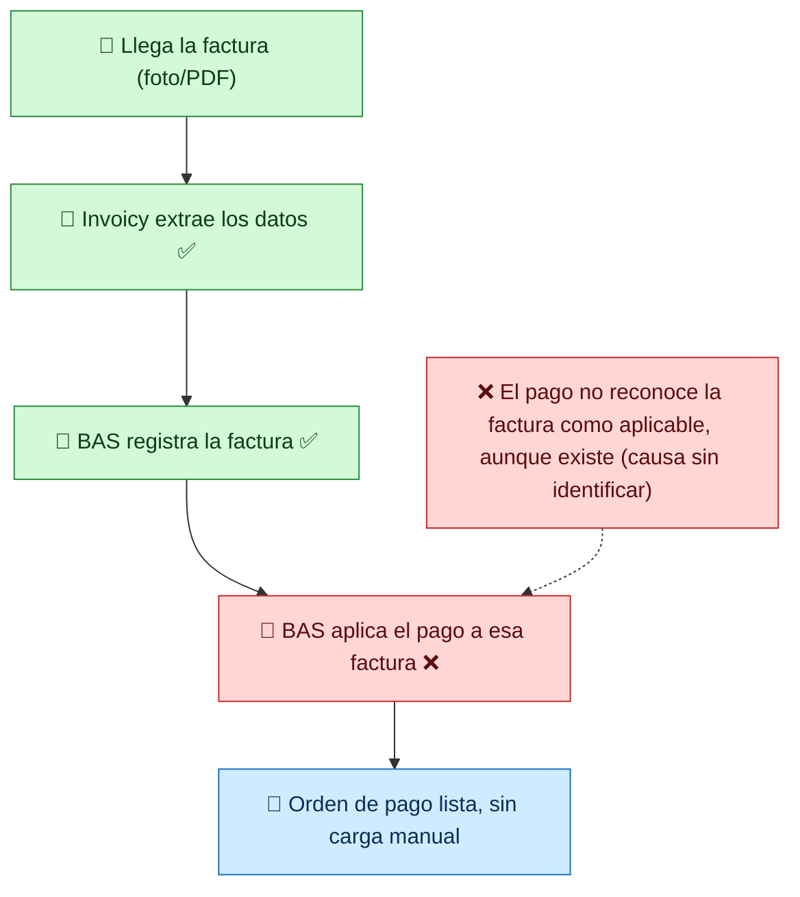
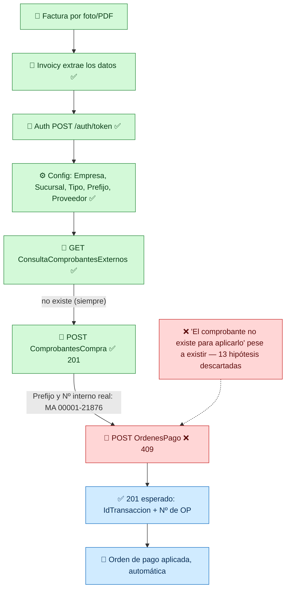
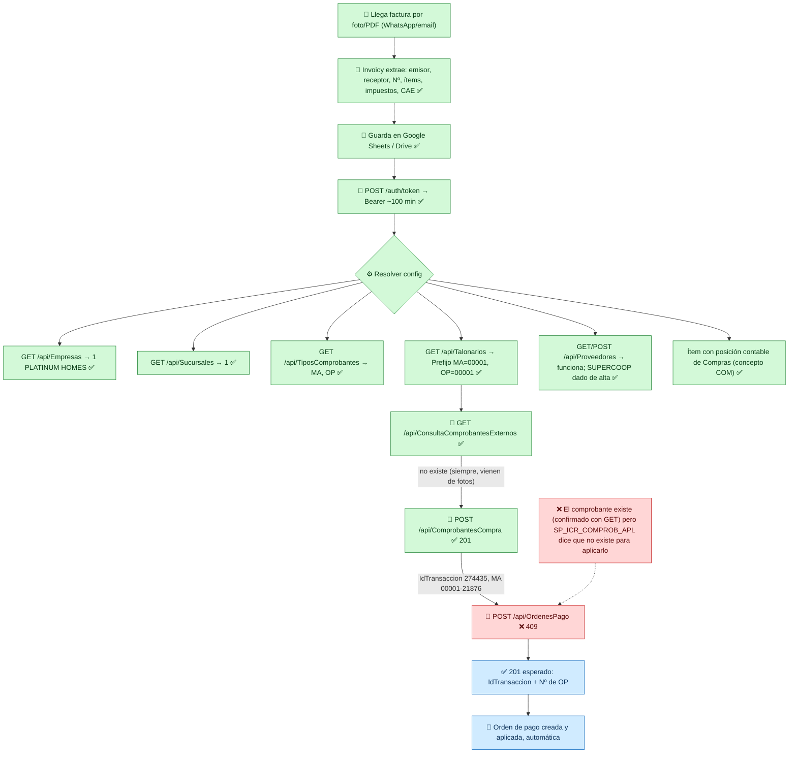

# Flujo Invoicy → BAS: registro de factura y orden de pago

**Actualizado 2026-07-01.** El registro de la factura de compra **ya funciona** (`201`
real logrado). El bloqueo actual está en el **segundo paso**: aplicar esa factura a la
Orden de Pago. Detalle completo con todos los payloads en
[bas-orden-de-pago-research.md](bas-orden-de-pago-research.md).

**Estado (va en el texto del nodo, porque Excalidraw no importa colores):**
✅ funciona hoy · ⚠️ requiere config específica pero ya funciona · ❌ bloqueo actual, sin resolver ·
🎯 resultado esperado.

> Pegar en Excalidraw: **"+" → Mermaid**, pegás el bloque, *Insert*. Etiquetas en una
> sola línea (sin saltos forzados) para que no aparezca texto raro.

---

## 1) Vista ejecutiva (sin endpoints)

**En una frase:** ya conseguimos que BAS registre la factura real (antes era el
problema). Ahora el bloqueo es más chico y más raro: al crear la orden de pago, el
sistema dice que esa factura "no existe para aplicarla", aunque confirmamos que sí existe.

---

## 2) Vista técnica (flujo con endpoints)

**Cómo leerlo:** desde `A` hasta `F` (registro de la factura), todo funciona de
verdad — no es teoría, se probó con `Total=1` y quedó confirmado con `GET`. El
bloqueo está únicamente en `G`, la creación de la orden de pago.

- **D** — incluye ahora el proveedor: se dio de alta a SUPERCOOP como proveedor real
  (`POST /api/Proveedores`), y se confirmó que el registro funciona igual con un
  proveedor nuevo o uno preexistente (Thymbra).
- **E → F** — la factura se registra con un payload de **12 campos específicos**
  descubiertos por prueba y error (depósito, caja, centro de apropiación, CAE, método
  de pago a cuenta corriente, total gravado, ítem con posición contable de Compras
  configurada). Resultado real: `201`, `IdTransaccion 274435`, factura `MA 00001-21876`.
- **G** — con esa factura real ya registrada, `POST /api/OrdenesPago` sigue devolviendo
  `409`: *"El comprobante MA 00001-00021876 no existe para aplicarlo"* — a pesar de que
  `GET /api/ConsultaComprobantes` confirma que existe y no está anulado. Se probaron
  13 variantes (moneda, formato de número, medio de pago, imputación contable, signo
  del importe...) sin resolverlo.

---

## 3) Vista detallada (todos los pasos, con el detalle de cada bloqueo)

### Qué hace cada paso (técnico, en simple)

- **A1 → A3** – Llega la foto, Invoicy extrae los datos y los guarda en Sheets/Drive. Ya funciona, es el insumo del resto.
- **B1** – Autenticación → token Bearer.
- **C0 (C1–C6)** – Toda la config necesaria: empresa, sucursal, tipo de comprobante, talonario/prefijo, **proveedor** (el maestro ya funciona; se puede dar de alta uno nuevo o usar uno existente) y un **ítem con posición contable de Compras** (76% del catálogo ya la tiene; se usa uno como "Gastos Generales").
- **D1** – Se confirma que la factura no está en BAS (siempre pasa, porque llegan desde fotos).
- **E1 – `POST /api/ComprobantesCompra` — ✅ FUNCIONA.** Requiere un payload con 12 campos específicos (depósito, caja, centro de apropiación, CAE, método de pago a cuenta corriente, total gravado). Devuelve `201` con el número interno real de la factura.
- **F1 – `POST /api/OrdenesPago` — ❌ BLOQUEADO.** Con la factura real ya registrada y referenciada correctamente, el sistema responde que "no existe para aplicarla". No es un dato faltante (como fue el caso del proveedor o la posición contable) — es un comportamiento inconsistente del servidor que no se resolvió variando el payload.
- **G1 → G2** – Resultado esperado una vez resuelto F1: `201` con el número de OP → pago creado y aplicado, automático.

---

## Qué tenemos vs. qué falta (actualizado)

| ✅ Ya funciona (probado con `Total=1`, confirmado con `GET`) | ❌ Bloqueo actual |
|---|---|
| Extracción de datos (Invoicy) | La Orden de Pago no reconoce la factura como "aplicable" |
| Autenticación | |
| Empresa, Sucursal, Tipos de comprobante, Talonarios/Prefijos | |
| Maestro de Proveedores (alta y consulta) | |
| Ítems con posición contable de Compras | |
| **Registro de factura de compra → `201` real** | |

## El único bloqueo que impide cerrar hoy

**`POST /api/OrdenesPago` responde `409`: "El comprobante no existe para aplicarlo"**,
aunque el comprobante existe (confirmado con `GET /api/ConsultaComprobantes`,
`Anulado: false`). Se descartaron 13 causas posibles (formato de número, moneda,
medio de pago, imputación contable, signo del importe, timing). El nombre del stored
procedure involucrado (`SP_ICR_COMPROB_APL`, prefijo `ICR`) sugiere que es específico
de la capa de integración por API — posible caso no cubierto en el ambiente de pruebas
(`PLATINUM_TEST`, confirmado por el nombre real de la base de datos). **Requiere
revisión de alguien con acceso al servidor de BAS.**

## Resultado esperado al destrabar

Con ese único punto resuelto, `POST /api/OrdenesPago` pasa de `409` a `201`: orden de
pago creada y aplicada a la factura, **automática de punta a punta** — ya no faltaría
nada más de configuración, todo lo demás (extracción, registro de factura, proveedores,
posiciones contables) ya está confirmado y funcionando.
